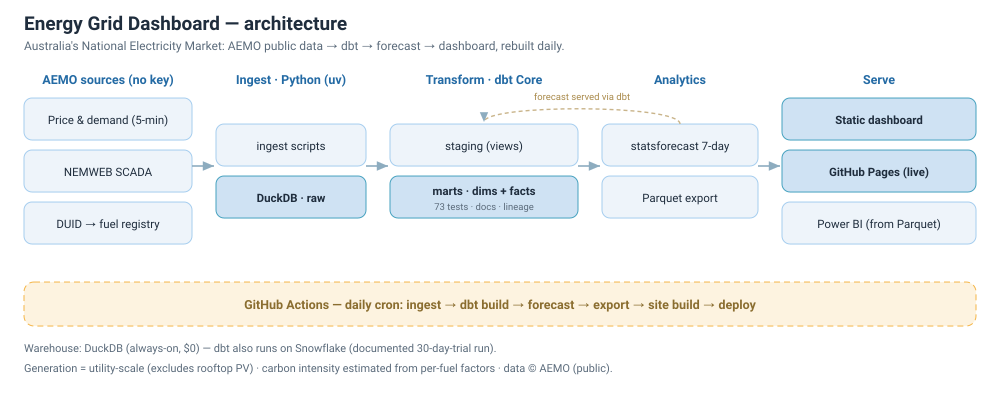

# Energy Grid Dashboard

Australia's electricity market publishes price, demand and generation data every five
minutes, with years of historical data available for free. I wanted to see what that data
could tell me about the changing electricity grid, particularly the growth of renewables
and the increase in negative electricity prices.

Live: https://bolat-t.github.io/Energy-Grid-Dashboard/ · [data model & lineage](https://bolat-t.github.io/Energy-Grid-Dashboard/dbt/index.html) · [what I found](https://github.com/bolat-t/Energy-Grid-Dashboard/blob/main/FINDINGS.md)

The pipeline runs automatically each morning and pulls the latest data from AEMO.

## What it found

- Renewables now make up around a third of utility-scale generation nationally, but the mix
  varies a lot between states. Tasmania is close to 100% renewable because of its hydro
  generation, while South Australia is around 75% from wind and solar.
- Around one in seven five-minute intervals had a negative electricity price over the six
  years I looked at. In 2025, South Australia had negative prices in around 30% of intervals.
- Victoria has the highest estimated carbon intensity of the five states, largely because of
  its reliance on brown coal. Tasmania is close to zero because most of its electricity comes
  from hydro.
- Electricity demand has stayed fairly flat over the six-year period despite population
  growth. Rooftop solar is part of the reason, as it reduces the amount of electricity
  households need to draw from the grid.
- A seven-day demand forecast was within about 3% in the more stable states and around 7% in
  South Australia. I also compared a Python forecasting model with Snowflake's built-in
  forecasting. Snowflake performed better overall, although the results varied between states.

The longer version, including some of the problems I ran into while running the pipeline in
the cloud, is in [FINDINGS.md](https://github.com/bolat-t/Energy-Grid-Dashboard/blob/main/FINDINGS.md).

## How it works



Python pulls the raw files from AEMO and loads them into DuckDB. I used DuckDB as the main
warehouse because the entire project can run locally from a single file, and a full rebuild
only takes a few seconds. dbt then handles the transformations, tests and data models, with
68 tests running as part of the build.

The dashboard is built from the dbt marts and published to GitHub Pages. GitHub Actions runs
the pipeline each morning, so the data and dashboard can update without any manual steps.

I also rebuilt the same dbt project in Snowflake to see how easily the models would transfer
to a cloud warehouse. The resulting marts matched the DuckDB versions. I then used Snowflake's
built-in forecasting and anomaly detection alongside the Python models.

The Snowflake setup is documented in [SNOWFLAKE.md](https://github.com/bolat-t/Energy-Grid-Dashboard/blob/main/SNOWFLAKE.md).
The forecasting and anomaly results from that run are committed as seeds so they remain
available after the Snowflake trial ends.

## A couple of things to keep in mind

- Generation data is utility-scale only. Rooftop solar is not included in the generation
  figures because AEMO accounts for it as reduced demand rather than generation.
- Carbon intensity is an estimate based on standard emission factors for each fuel type
  (`transform/seeds/seed_fueltech.csv`), rather than AEMO's official carbon intensity figures.

## Running it

```
uv sync                                                 # Python 3.12 venv + deps

uv run python -m energy_grid.ingest_price_demand        # AEMO price & demand, 72 months
uv run python -m energy_grid.build_duid_fueltech_seed   # generator -> fuel type, from AEMO's registry
uv run python -m energy_grid.ingest_generation          # per-generator 5-min output, ~24 months

cd transform
uv run dbt deps --profiles-dir .
uv run dbt build --profiles-dir . --exclude fct_demand_forecast fct_forecast_accuracy
cd ..
uv run python -m energy_grid.forecast_demand            # reads the marts, writes the forecast back
cd transform && uv run dbt build --profiles-dir .       # everything, incl. forecast marts
uv run dbt docs generate --profiles-dir . --static       # self-contained docs site

cd ../reports && npm install && npm run sources && npm run dev   # dashboard on :3000
```

`data/` and `.env` are gitignored. The first generation download takes longer because it
backfills a couple of years of five-minute readings for generators across the NEM. After
that, the pipeline only needs to fetch new data.

## Layout

```
src/energy_grid/         ingestion, forecasting, export, Snowflake setup
transform/               dbt project: models, seeds, tests, macros
reports/                 dashboard pages and source queries
docs/                    architecture diagram
.github/workflows/       daily refresh and deployment
```

Deployment notes are in [DEPLOY.md](https://github.com/bolat-t/Energy-Grid-Dashboard/blob/main/DEPLOY.md).

## Data

The data comes from the Australian Energy Market Operator's public datasets, including
aggregated price and demand data and the MMSDM dispatch archive on NEMWEB for
generator-level output.

No API key is required. © AEMO; used here for non-commercial, educational purposes.
